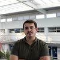
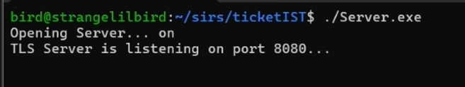
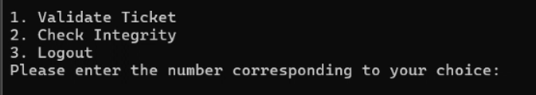
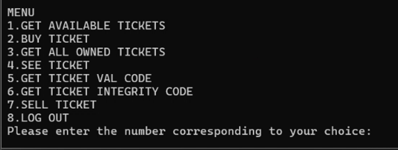
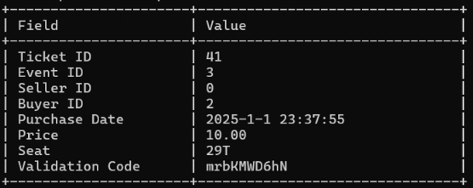

# T60 TicketIST Project Read Me

## Team

| Number | Name              | User                             | E-mail                                            |
| -------|-------------------|----------------------------------| --------------------------------------------------|
| 90118  | João Diegues      | <https://github.com/jrcdiegues>  | <mailto:jrcarrasqueirodiegues@tecnico.ulisboa.pt> |
| 92737  | André Morgado     | <https://github.com/Andrew1708>  | <mailto:andre.filipe.morgado@tecnico.ulisboa.pt>  |
| 99122  | Sofia Sancho      | <https://github.com/SofiaSancho> | <mailto:sofia.sancho@tecnico.ulisboa.pt>          |

  

## Contents

This repository contains documentation and source code for the *Network and Computer Security (SIRS)* project.

The [REPORT](REPORT.md) document provides a detailed overview of the key technical decisions and various components of the implemented project.

It offers insights into the rationale behind these choices, the project's architecture, and the impact of these decisions on the overall functionality and performance of the system.

This document presents installation and demonstration instructions.

## Installation

The goal for this project was to setup a virtual environment with 1 network and 5 machines. The project is only capable of running accordingly in the local machine, but the desired setup would simulate a distributed system with a MySQL database configured locally on the host system. Virtual machines can be then utilized for the server, two clients, and a validator, all running the Kali Linux 2024.3 distribution. The VM of the server connects to the DB running on the host systems, and the validator and each client connects to the server.

### Prerequisites

All the virtual machines are based on: Linux 64-bit, Kali 2024.3

[Download](https://www.virtualbox.org/) and [Install](https://www.kali.org/docs/virtualization/install-virtualbox-guest-vm/) a virtual machine of Kali Linux, using VirtualBox.

Clone the base machine to create the other machines.

### Machine configurations

Inside each machine, use Git to obtain a copy of all the scripts and code.

```sh
$ git clone https://github.com/tecnico-sec/T60
```

Each of the virtual machines should run the dependencies to compile the code:

```sh
$ sudo apt-get install libmysqlcppconn-dev
$ sudo apt-get install libssl-de
```

### Local Machine

The local machine must run the database server (MySQL 9.1) with the sql tables present in the db folder of the repository.

#### Machine 1 - Server

This machine runs the server.

It should compile the project by running this command in the main directory:

```sh
$ make
```

Key generation:

```sh
$ ./GenerateServerKeys.exe
```

Running the server:

```sh
$ ./Server.exe
```

The TLS Server should open and keep waiting for messages

If the database is not connecting, change the DB_IP value in the Server.cpp file to the Local Machine's ip

#### Machine 2 - Validator

This machine runs the validator. It should compile the code:

```sh
$ make
```

Run:

```sh
$ ./Validator.exe
```

#### Machines 3 and 4 - Clients

These machines run the clients. Each of them should compile the code:

```sh
$ make
```

Run:

```sh
$ ./Client.exe
```

## Demonstration

Once the server runs successfully it should look like:



After the validator and the client sign up or log in, they should be seeing the following menus:





Ticket View upon Client's request:



## Additional Information

### Links to Used Tools and Libraries

- [GCC 14.2](https://gcc.gnu.org/releases.html)

### License

This project is licensed under the MIT License - see the [LICENSE.txt](LICENSE.txt) for details.

----
END OF README
