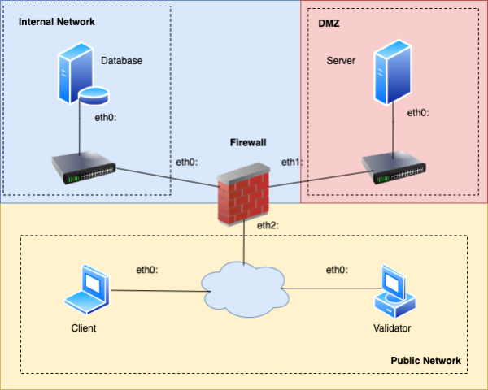
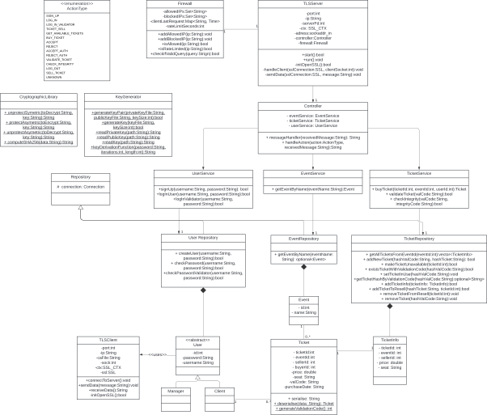
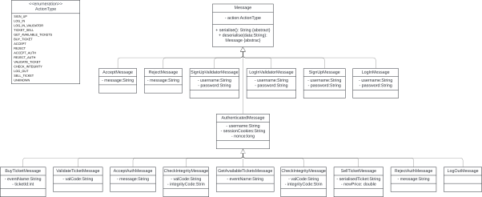
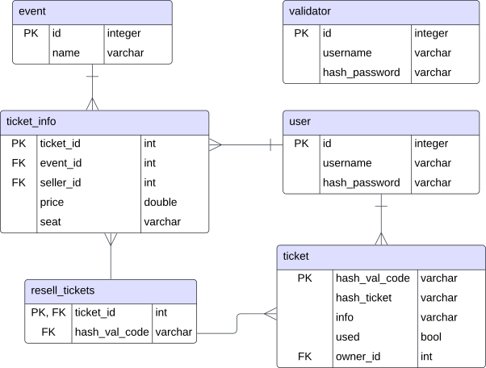
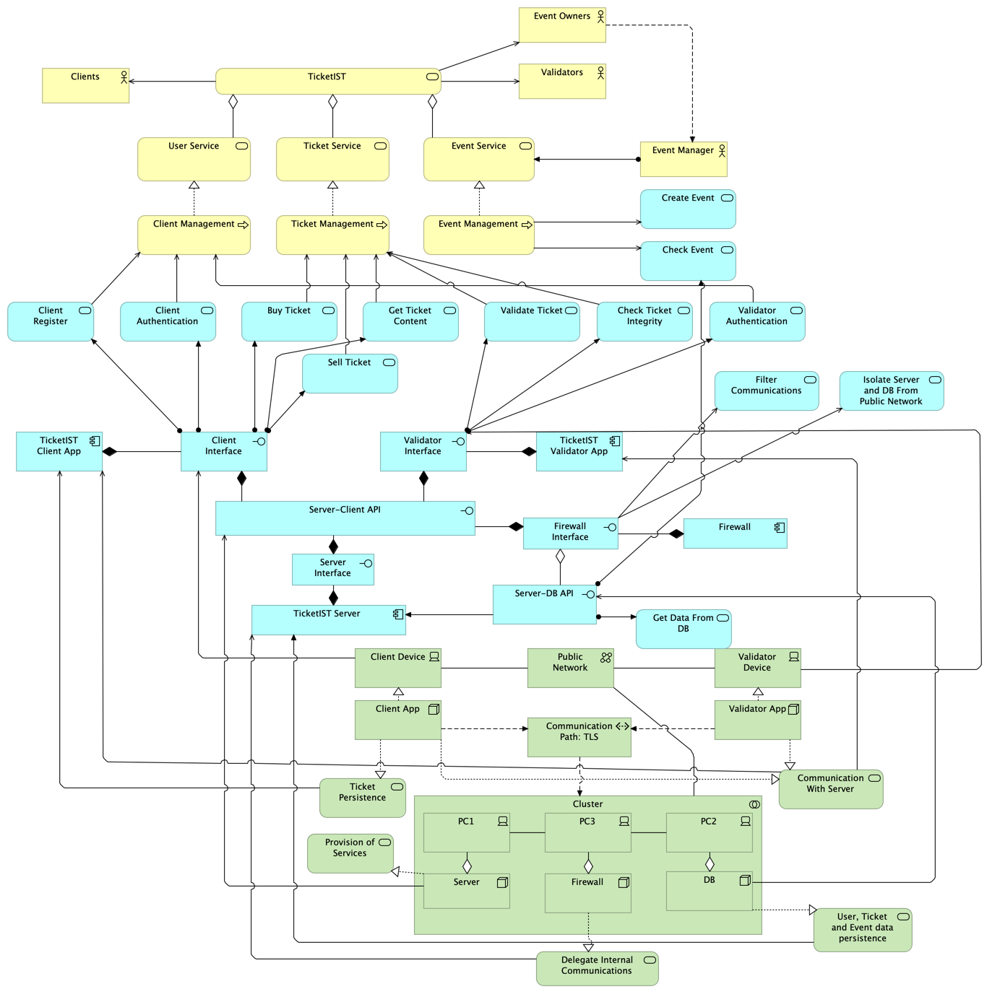

# TicketIST – A secure application to transfer event tickets

**SIRS – Master in Computer Science and Engineering**  
Instituto Superior Técnico, Universidade de Lisboa  

João Diegues – ist90118  
André Morgado – ist92737  
Sofia Sancho – ist99122  
Group – T60  

---

## Table of Contents
1. [INTRODUCTION](#1-introduction)  
2. [REQUIREMENTS ANALYSIS](#2-requirements-analysis)  
   2.1 [Functional Requirements](#21-functional-requirements)  
   2.2 [Non-functional Requirements (Security Requirements)](#22-non-functional-requirements-security-requirements)  
3. [SYSTEM DESIGN](#3-system-design)  
   3.1 [Design Assumptions](#31-design-assumptions)  
   3.2 [Enterprise Architecture](#32-enterprise-architecture)  
   3.3 [Network Architecture](#33-network-architecture)  
   3.4 [Software Design](#34-software-design)  
   3.5 [Database Schema](#35-database-schema)  
4. [THREAT MODEL](#4-threat-model)  
   4.1 [Assets](#41-assets)  
   4.2 [Adversaries](#42-adversaries)  
   4.3 [Threats](#43-threats)  
   4.4 [Mitigation Strategies](#44-mitigation-strategies)  
   4.5 [Prioritized Risks](#45-prioritized-risks)  
   4.6 [Conclusion](#46-conclusion)  
5. [IMPLEMENTATION](#5-implementation)  
   5.1 [Design Differences](#51-design-differences)  
   5.2 [Programming language](#52-programming-language)  
   5.3 [Presentation Layer](#53-presentation-layer)  
   5.4 [Service Implementation](#54-service-implementation)  
   5.5 [Communication layer](#55-communication-layer)  
   5.6 [Data Access Layer](#56-data-access-layer)  
6. [CONCLUSION](#6-conclusion)  
[A DIAGRAMS](#a-diagrams)  

---

## 1 INTRODUCTION
TicketIST is a secure application designed to manage, validate, and transfer event tickets. The project focuses on creating a reliable system that ensures ticket confidentiality, integrity, and availability while providing a user-friendly experience.  
The system is built based on clear functional and security requirements, using secure communication protocols, cryptographic methods, and a layered architecture to protect user data and transactions.  

This report explains the development of TicketIST, starting with the requirements analysis, followed by the system design, threat modeling, and implementation. It evaluates how well the project meets its goals and highlights areas for improvement. TicketIST demonstrates how secure digital ticketing can work effectively, meeting the needs of users, validators, and event organizers. The security challenge chosen was A.

---

## 2 Requirements Analysis
This section introduces the functional and non-functional requirements that served as the foundation for developing the project. We outline a set of functional requirements identified during the project planning phase, along with the non-functional requirements specified in the project description. Together, these requirements provide a comprehensive framework that guided the system's design and implementation.

### 2.1 Functional Requirements
The solution is based on a set of functional requirements that outline the core functionalities and objectives of the project. These requirements define what the system must accomplish to deliver an efficient, secure, and user-friendly platform for purchasing, managing, and validating electronic tickets for IST events. Below are the functional requirements, detailing the key features and actions the application supports.

- **FR1**: The system shall allow users to browse available tickets and view their details (e.g., seat and price).  
- **FR2**: The system shall enable users to purchase tickets online by selecting a ticket.  
- **FR3**: The system shall generate a unique validation code for each purchased ticket.  
- **FR4**: When selling a ticket the system shall generate a unique validation code for the ticket.  
- **FR5**: The system shall allow users to store their purchased tickets locally on their computers in an encrypted format.  
- **FR6**: The system shall allow users to visualize all of their owned tickets.  
- **FR7**: The system shall allow event organizers to validate electronic tickets provided with the validation code.  
- **FR8**: The system shall allow users to present their tickets via validation codes or similar mechanisms for validation.  
- **FR9**: The system shall display the validation status (e.g., "valid," "invalid") to the event verifier after scanning a ticket.  
- **FR10**: The system shall allow event validators to check the integrity of the presented ticket.  
- **FR11**: The system shall allow users to resell their tickets to other users through an integrated platform.  
- **FR12**: The system shall display the ticket price and associated details during resale.  
- **FR13**: The system shall automatically transfer ownership of the ticket to the new buyer upon completion of the resale transaction.  
- **FR14**: The system shall allow users to create accounts by providing a username and password.  
- **FR15**: The system shall allow users to log in to their accounts to manage their tickets and purchases.

### 2.2 Non-functional Requirements (Security Requirements)
In terms of non-functional requirements, we adhered strictly to those outlined in the project proposal, which primarily address security. This approach ensured alignment with the project's objectives and maintained development process primarily focused on cybersecurity.

**Security Requirements**  
- **SR1**: The system shall ensure that only the buyer, seller, and event validator can view the content of a ticket to maintain confidentiality.  
- **SR2**: The system shall provide a mechanism to validate a ticket using a unique code to ensure its authenticity.  
- **SR3**: The system shall detect any unauthorized modifications to a ticket (e.g., altering seat information) to preserve its integrity.  
- **SR4**: The system shall prevent stolen tickets from being used by unauthorized individuals to attend the event.  
- **SRA1**: The system shall require users to authenticate themselves using a cryptographic mechanism before purchasing tickets.  
- **SRA2**: The system shall enforce a maximum purchase limit of six tickets per user to prevent ticket scalping or automated scraping.  
- **SRA3**: The system shall invalidate the seller’s access to a ticket after it has been resold, even if the seller retains a copy of the ticket code locally.

---

## 3 System Design
This chapter presents the system design, encompassing both the application's architecture and the database design, with a focus on the high-level structure established during the planning phase. It outlines the core components, their responsibilities, and the interactions that collectively enable the system’s functionality. The design assumes the presence of certain services, which were conceptualized as being provided by third-party systems; this assumption will be clarified in the first chapter. Additionally, it is important to note that this chapter reflects the original design vision for the project. However, certain aspects do not align with the final implementation, a distinction that will be addressed in the beginning of the next chapter.

### 3.1 Design Assumptions
1. To streamline the development process and focus on the core functionality of our system, we introduced several simplifications. These choices allow us to concentrate on the primary goals of the application while deliberately leaving out features or considerations that are beyond the scope of this project.  
2. In our application, any individual can sign up by simply providing a username and password. However, in a real-world scenario, this approach would be impractical and insecure, as additional information—such as an email address—is typically required to establish a reliable link between the user and their account. Implementing such a feature would involve verifying whether the email address exists and sending verification emails, which is beyond the scope of this project. Without such verification, the system becomes vulnerable to abuse, as malicious users could easily create multiple fake accounts and potentially overwhelm our computational resources. For the sake of simplicity, this limitation is acknowledged but intentionally ignored in our current implementation.  
3. We assume that the monetary transactions involved in buying and selling tickets are handled by a third-party service. This allows our application to focus primarily on securely storing and delivering tickets, without managing or being concerned with the complexities of funds transfers.  
4. We assume that events and their associated tickets are added to the application by an external, authorized entity, referred to as a "super user." However, we did not implement or define this super user in detail to avoid introducing potential vulnerabilities. Specifically, concretizing this role could lead to privilege escalation attacks, allowing malicious actors to create or delete events without authorization. Additionally, our primary focus was on the client-server interaction rather than internal administrative functionalities. Since events are physical occurrences that require thorough validation (e.g., verifying the event’s existence, number of tickets, seating arrangements, etc.), we assumed that these validations are performed externally. Once validated, events and tickets are added either through an internal application or directly into the database.  
5. We assume that validators are added to the application through an external process. This assumption was made to prevent unauthorized individuals from validating tickets, as ticket validation renders the ticket unusable, which could pose a significant security risk. Therefore, we considered the creation of validator accounts to be a bureaucratic process conducted outside the application.  
6. We Assumed the server to have a fixed IP.  
7. We assumed that ticket validation is performed verbally. Upon arriving at the event venue, the client provides the validation code, which the validator enters in their system to confirm its validity and grant the client access.  
8. We assumed a fixed server certificate and public key used in communications which is built in the application handled to the users.

### 3.2 Enterprise Architecture
This chapter explores the enterprise architecture of the application, structured around the business, application, and technology layers. Each layer is analyzed to provide a comprehensive view of how the system supports its functionality and objectives. The business layer focuses on the processes and roles that drive the application’s purpose, the application layer highlights the software components and their interactions, and the technology layer details the infrastructure supporting the system. A visual representation of these layers is provided in Figure A1, which serves as a reference point throughout this discussion.

#### Business Layer
Our application has four main types of actors:  
1. Clients: who buy, sell, and use their tickets.  
2. Validators: who validate and check the integrity of tickets.  
3. Event Owners: who are responsible for creating events and their associated tickets.  
4. Event Managers: who handle the administrative validation of events and tickets.

As mentioned in the "Design Assumptions" chapter, the functionalities associated with the event owner and event manager roles were not fully implemented in the application. Instead, these roles are assumed to function as described for the purposes of this project.

TicketIST provides three core services:  
1. **User service**: responsible for managing user-related functionalities such as registration and authentication.  
2. **Ticket service**: which handles the entire lifecycle of tickets, including purchasing, reselling, and storing.  
3. **Event service**: tasked with managing events, primarily verifying their existence. These services work together to ensure the platform's operational goals.

#### Application Layer
This layer supports our business logic with 4 principal components:

1. **TicketIST Server**: The central component of our application, responsible for implementing the server interface. It handles user requests and manages persistent data by accessing and modifying it as needed.  
2. **TicketIST Client App**: This component serves as the client endpoint, implementing a client Interface that generates requests based on user input. It enables users to register and authenticate, as well as perform actions such as buying, selling, and viewing their owned tickets.  
3. **TicketIST Validator App**: Similar to the Client App, this component implements a Validator Interface, allowing validators to validate tickets and check their integrity.  
4. **Firewall**: This component acts as an intermediary between users and the server, as well as between the server and the database. It implements a Firewall Interface, which serves the server by filtering unwanted or potentially harmful communications.

All the interfaces implemented by these components collectively form the Server–Client API, which establishes the connection between the server and the users. This API ensures that communication is handled in an abstracted manner, giving the appearance that users are interacting directly with the server. Additionally, there is another interface, the Server–DB API, which facilitates the server's access to the data stored in the database.

#### Technology Layer
To support the application layer, we propose a setup of five machines (or virtual machines), assuming only two users (one client and one validator):

1. **Client**: Responsible for facilitating communication with the server and persistently storing tickets on disk.  
2. **Validator**: Similar to the client, it ensures communication with the server and handles validation-related tasks.  
3. **Server**: Manages the core application services, including processing user requests and ensuring proper data flow.  
4. **Database**: Maintains persistent logical data related to users, tickets, and events.  
5. **Firewall**: Intermediates and securely delegates communication between users and the server, as well as between the server and the database.

All these machines run on Linux Ubuntu. Communication between components occurs through a Transport Layer Security (TLS) channel, with further details provided in the [Network Architecture](#33-network-architecture) chapter.

### 3.3 Network Architecture
This chapter provides an overview of the network architecture, outlining the communication framework between the system's components.

As depicted in **Figure A2** (below), the network architecture identifies four key actors, with clients and validators collectively categorized as users:

1. **Users**: These actors access the service through the public network and establish a connection with a computer running the firewall.  
2. **Firewall**: The firewall operates within the internal network, acting as an intermediary for both user-server and server-database communications. It features a denylist to block unauthorized communication from users to the server, effectively mitigating attacks such as unauthorized access and resource exhaustion by filtering suspicious IP addresses. This denylist is dynamically updated based on anomalous activity detected by the server, such as excessive requests, error-causing inputs, or unexpected patterns. However, for server-database interactions, requests remain visible for the firewall, allowing the firewall to enhance data security by filtering out potentially dangerous requests. This is achieved using a blacklist of prohibited operations, designed to prevent harmful actions and provide an additional layer of protection to sensitive data. Additionally, the firewall enforces an allowlist to ensure that only the server can perform database requests, maintaining strict access control.  
3. **Database**: The database is securely isolated within the internal network and is configured to accept requests exclusively from the firewall. Access to the database is protected by a password, requiring the firewall to authenticate with the correct credentials to retrieve its contents. Additionally, the principle of least privilege is strictly enforced by granting only the minimum permissions necessary for the service to operate effectively, ensuring a robust layer of security while maintaining functionality.  
4. **Server**: The server operates in a dedicated subnetwork within the internal network, specifically within a demilitarized zone (DMZ). This configuration adds an additional layer of security by isolating the server from the internal network, reducing the risk of attackers gaining direct access to sensitive resources. By shielding the internal network, this setup further safeguards the database, as any potential compromise of the server does not provide direct access to the database or other critical components. Access to the server is tightly controlled, with the server configured to accept requests exclusively from the firewall’s IP address. As previously described, the firewall also protects the server by blocking communications from suspicious IP addresses, leveraging a denylist dynamically updated based on detected anomalies. This comprehensive approach ensures that only authorized and validated traffic reaches the server, enhancing the overall security of the network architecture.

All communications should occur over TLS channels to ensure confidentiality, integrity, authentication, and freshness. TLS encryption prevents eavesdropping and man-in-the-middle attacks, while integrity checks guard against data tampering during transmission. In practice three TLS channels are created upon user contact: user-firewall, firewall-server, and firewall-database.

### 3.4 Software Design
This section provides an in-depth overview of the primary classes implemented in our application. The UML diagram for TicketIST, presented in **Figure A3**, is a simplified representation that conveys the general structure and core concepts of the application.

TicketIST is implemented in C++ and adheres to the principles of the Layered Architecture Pattern, ensuring a clear separation of concerns and robust maintainability. The application is structured into 5 distinct layers: **presentation**, **application**, **domain**, **data**, and **infrastructure**.

#### Presentation Layer
This layer is responsible for processing user input and translating it into meaningful interactions with the underlying business services. It is implemented as executables running on the user's device (the client-side of the application), designed to await user input and initiate the appropriate communication with the server. Users are presented with a list of numbered actions and are required to select their desired action by entering the corresponding number. When necessary, users may also be prompted to provide additional information to complete the requested operation.

On the server side, the application is structured following the **Controller-Service-Repository** architectural pattern. The controller serves as the primary interface between the user and the application. Its role is to process user requests, transmit them to the server using a predefined messaging format, and handle these requests by delegating business logic operations to the Service Layer. Furthermore, the controller is responsible for managing responses, ensuring that users receive accurate and well-structured feedback.

#### Application Layer
The Application Layer serves as the intermediary between the Presentation Layer and the underlying business logic, orchestrating operations and enforcing business rules. It is implemented through service classes, where the core business logic of the application resides. This layer processes user input, applies business rules, and manages the flow of operations. When necessary, it interacts with the Repository Layer to perform data-related tasks. The service layer is further divided into three distinct classes: **UserService**, **EventService**, and **TicketService**, each responsible for managing a specific set of business rules.

#### Domain Layer
The Domain Layer represents the core abstraction of the application's business domain, encapsulating the fundamental concepts in which the service operates. It consists of the following components: **User**, which is further divided into Manager and Client; **Ticket**, which contains the ticket information; and **Event**, which represents the associated event.

#### Data Access Layer
This layer is responsible for managing the application’s data by directly interacting with storage mechanisms, such as memory or disk. It performs Create, Read, Update, and Delete (CRUD) operations while ensuring data integrity and consistency. It is implemented through the Repository classes (and their parent class), which maintain a persistent connection to the database and execute queries when invoked by the service layer.

#### Infrastructure Layer
This layer is represented by the classes **TLSServer** and **TLSClient**, which ensure secure communication between the entities within the business domain. It is responsible for opening TLS sockets, sending data, receiving data, and passing the data to the next layer of the application.  

The server will ignore any message that does not follow these predefined formats. This layer operates on a set of predefined message types, which are implemented as specific classes, as shown in **Figure A4**:

Conceptually, there are two main categories of messages: **unauthenticated messages** (**Message**) and **authenticated messages** (**AuthenticatedMessage**). Unauthenticated messages are used during the initial interaction with the server, such as when the user logs in or signs up. Once authenticated, the user sends authenticated messages for subsequent service requests. These messages include additional attributes, such as the username, a token (session cookies) to uniquely identify the user, and a nonce to ensure message freshness and prevent replay attacks.

##### Cryptography
Additionally, the **CryptographicLibrary** and **KeyGenerator** are transversal components within the application. The CryptographicLibrary provides implementations for symmetric encryption using AES, asymmetric encryption using RSA, and hashing using the SHA-256 algorithm. The KeyGenerator class is responsible for generating the symmetric and asymmetric keys used by these algorithms, reading keys from files, converting them into usable formats, and implementing a key generation function that derives a symmetric key from an input password.

### 3.5 Database Schema
The database is formed by 6 tables:

1. **user**: Stores the user’s ID, username, and hashed password. This table is primarily used for user registration and authentication within the application.  
2. **validator**: Similar to the user table, this table manages the information of validators who verify tickets.  
3. **event**: Contains the events from the tickets, their id and name.  
4. **ticket_info**: Holds information about tickets currently available for purchase, including ticket ID, event ID, seller ID, price, and seat. This table is accessed by users to view available tickets, purchase tickets, or list tickets for resale.  
5. **ticket**: Stores the hash of the validation code for valid tickets, a ticket hash for integrity checks, disclosed information (e.g., seat) needed by the validator, a boolean indicating whether the ticket has been used, and the ticket owner's ID. This table is used during ticket purchases and is primarily accessed by validators to validate and verify ticket integrity.  
6. **resell_tickets**: Contains the hash of the validation code of tickets being resold and the reseller's ID. This table facilitates ticket resale operations and is used when resold tickets are purchased or listed for sale.

---

## 4 Threat Model

### 4.1 Assets
The critical assets requiring protection in the TicketIST system include:

- **User Credentials**: Authentication details for users, validators, and event managers.  
- **Tickets**: Ownership, validation codes, and associated metadata.  
- **Sensitive Data**: Information stored in the database, such as event details and ticket validation hashes.  
- **Cryptographic Keys**: Keys used for encrypting tickets and securing communications.

### 4.2 Adversaries
Potential adversaries include:

- **External Attackers**: Attempt to exploit vulnerabilities to gain unauthorized access to tickets or the database.  
- **Internal Threats**: Malicious or negligent users who may abuse their roles.  
- **Intermediate Attackers**: Eavesdroppers capable of intercepting communications or accessing stored data.

### 4.3 Threats
This section aligns with the security requirements in Chapter 2 and highlights specific threats to confidentiality, integrity, and availability. The outlined threats and mitigations expand upon the practical considerations described in Chapter 3.

**Confidentiality**:  
- Unauthorized access to user tickets.  
- Eavesdropping on ticket purchase or validation communications.

**Integrity**:  
- Tampering with ticket information, such as altering validation codes or seating details.  
- Modifying user accounts or event data in the database.

**Availability**:  
- Denial-of-Service (DoS) attacks to disrupt ticket validation or purchase services.  
- Overloading the server with fake requests.

**Authentication and Authorization**:  
- Brute-force attacks to gain access to user accounts.  
- Exploiting session management flaws to hijack user sessions.

**Replay Attacks**:  
- Reuse of intercepted validation or integrity codes to falsely validate tickets.

**Insider Threats**:  
- Validators or administrators abusing privileges to manipulate ticket data or access unauthorized information.

### 4.4 Mitigation Strategies
Mitigation strategies outlined here reference implementations detailed in Chapter 3 and ensure alignment with the functional and security requirements in Chapter 2.

**Confidentiality**:  
- **Data Encryption**: Encrypt tickets using AES and secure communications via TLS, as described in Chapter 3.  
- **Role-Based Access Control (RBAC)**: Restrict access to ticket data based on user roles (buyer, seller, validator).  
- **Session Management**: Use session tokens and nonces to secure user sessions and prevent reuse of credentials.

**Integrity**:  
- **Hash Verification**: Store ticket hashes and validate them during every operation. Aligns with the database structure in Chapter 3.  
- **Integrity Codes**: Use partial hashes to allow validators to confirm ticket integrity without exposing sensitive data.  
- **Database Security**: Limit permissions and implement the principle of least privilege for database access.

**Availability**:  
- **Firewall**: As noted in Chapter 3, the integrated firewall uses denylists, allowlists, and rate-limiting to mitigate DoS attacks. While the firewall is currently integrated with the server, future iterations could deploy it on a dedicated machine to enhance resilience.  
- **Resilience**: Implement rate-limiting and resource prioritization to mitigate DoS attacks.

**Authentication and Authorization**  
- **Password Management**: Use salted hashing (SHA-256) for passwords and enforce strong password policies.  
- **Multi-Factor Authentication (MFA)**: Optional feature for additional security for high-privilege roles.  
- **Session Expiry**: Regularly expire session tokens and require re-authentication.

**Replay Attacks**:  
- **Nonces**: Increment nonces in every message to prevent replay of old messages.  
- **Timestamp Validation**: Enforce expiration of validation codes after a set period.

**Insider Threats**:  
- **Audit Logs**: Record all operations for validators and administrators to detect and address malicious behavior.  
- **Separation of Duties**: Isolate critical operations between roles to prevent misuse of combined privileges.

### 4.5 Prioritized Risks
Using the STRIDE model, risks are prioritized as follows:

- **Spoofing**: High – Strong authentication required for users and validators.  
- **Tampering**: High – Hash verification critical to prevent ticket data manipulation.  
- **Repudiation**: Medium – Audit logs needed to track user actions.  
- **Information Disclosure**: High – TLS encryption and ticket confidentiality are essential.  
- **Denial-of-Service**: Medium – Firewall rules and rate limiting mitigate this risk.  
- **Elevation of Privilege**: High – Strict RBAC and session management prevent role abuse.

### 4.6 Conclusion
The threat model identifies and addresses potential risks to the TicketIST system, focusing on ensuring robust security across all layers of the application. By implementing mitigation strategies aligned with the identified threats, TicketIST achieves a secure and resilient platform for managing event tickets. Unfortunately, implementing all these mitigation strategies is beyond the scope of what we hope to achieve with this project.

---

## 5 Implementation
This chapter details the practical aspects of the system's implementation, highlighting key differences between the initial design and the final implementation. It provides an overview of the technologies and external libraries utilized, offering insight into the tools and frameworks that supported the development process. Additionally, each user action within the application is analyzed in depth, describing the sequence of operations and interactions across the system. Lastly, this chapter justifies specific design and implementation decisions, explaining the rationale behind the chosen approaches and how they address the system's requirements and constraints.

### 5.1 Design Differences
The primary deviation from the original design is the inability to separate the firewall onto a dedicated machine. As a result, both the firewall and the server run on the same machine, meaning the server is not placed within a demilitarized zone (DMZ). The implemented firewall includes an allow list and a block list for filtering specific IPs, but it is integrated directly into the server itself, specifically within the TLSServer class. This limitation was a result of time constraints and suboptimal planning during the development process.

### 5.2 Programming language
TicketIST was developed, compiled, and tested in C++ (version 14.2.0 Ubuntu).

### 5.3 Presentation Layer
The presentation layer is divided into two types: one for clients and another for validators. This layer is implemented through the executables **Client.exe** and **Validator.exe**. We opted for this separation because the roles of clients and validators are fundamentally different, requiring distinct actions and interfaces. The only shared functionality between the two is authentication. When the executables are launched, both applications initially attempt to establish a connection with the server. If the connection is successful, the application proceeds to the next stage.

- **Validators** are immediately prompted to log in. Upon successful authentication, the application transitions to an authenticated state, enabling the validator to send “Authenticated Messages” to the server. In this state, the validator has access to three functionalities: validate a ticket, check ticket integrity, and log out.  
- **Clients** are presented with the option to either sign up to register a new account or log in. After successful authentication, the application transitions to an authenticated state (similar to the validator’s). In this state, the client can perform eight actions: check available tickets, purchase a ticket, view all owned tickets, inspect a specific ticket, retrieve a validation code, retrieve an integrity code, sell a ticket, and log out.

After the connection is established, the server continuously listens for incoming messages. These messages are received by the server's interface, the controller, which deserializes the data, interprets the request, and executes the corresponding action if it is valid.

### 5.4 Service Implementation
We will now present the implementation details of each action, using simplified language to align with the reader's current understanding of the system. For instance, when stating that "the server deletes the ticket from the ticket table," it is understood that this involves the server executing a database query to remove the ticket, with the query being transmitted securely via a TLS connection.

#### Sign up
The client sends a **SignUpMessage** containing the desired username and password. The password is salted, with the salt being generated using a pseudo-random function based on the user's username. The server receives the message and checks if the username already exists. If it does not, the server creates the new user by storing the username and the SHA-256 hash of the salted password in the **users** table. Upon success, the server sends an **AcceptAuthMessage**; otherwise, it sends a **Reject** message.

#### Log in
The log-in process applies to both users and validators. The client or validator sends their credentials (username and password) to the server. The application salts the password in the same manner as during sign-up. The server retrieves the corresponding record from the **users** or **validators** table, computes the SHA-256 hash of the received salted password, and compares it with the stored hash. If the hashes match, the server authenticates the client or validator and responds with an **AcceptAuthMessage**. Otherwise, it sends a **Reject** message, as in the sign-up process.

#### Authentication
The previous actions established a mechanism for authenticating users to the application. However, for security and efficiency, subsequent communications should not require users to repeatedly send their passwords or require the server to validate them continuously. To address this, we implemented a **token-based system** to manage user sessions, referred to as **session cookies**.

The **Controller** class manages session information using a mapping structure, where the key is the username, and the value is a pair consisting of a session token (cookie) and a nonce. Separate mapping structures are maintained for clients and validators to distinguish their respective sessions.

Upon successful authentication—whether through sign-up or log-in—the server generates a unique random token and nonce for the user. These values are sent to the user in an **AuthenticatedMessage**. Moving forward, the combination of the username and the session token serves as the primary authentication mechanism, eliminating the need for password revalidation. The server securely stores these token and nonce values to track active sessions.

To ensure freshness and prevent replay attacks, the server includes a nonce—a random value that is incremented with each user message. After authentication, the server expects the user to include the incremented nonce (**nonce+1**) in their messages. Upon receiving and validating an authenticated message, the server updates the stored nonce value.

If the server resets or restarts, all session tokens are invalidated, and users are required to re-authenticate. Similarly, if the client application crashes or fails and the user re-authenticates, the server overwrites the previous session values and generates a new token and nonce.

On receiving an **AcceptAuthenticatedMessage**, the client application transitions to an authenticated state. It dynamically stores the username, session token, and nonce in global variables, which are included in all subsequent authenticated messages. Users can only perform further actions, such as buying, selling, or validating, by sending messages with the correct authentication factors: username, session token, and nonce. If any of these factors are missing or incorrect, the server automatically rejects the request, ensuring secure and consistent session management.

For the subsequent actions, it is implicit that users send authenticated messages, which include the username, session token (cookie), and nonce; and the server will always check the user authentication, responding with a **RejectMessage** in case of failure to avoid disclosing sensitive session data to unauthorized users (potential attackers). The server responds with the same authentication tokens, with **AcceptAuthMessage** or **RejectAuthMessage**. Additionally, the client validates the presence of authentication tokens in server responses as an extra layer of security. This ensures that the responses are indeed from the server and pertain to the specific session. If the expected authentication tokens are not present in the response, the client aborts the ongoing process to prevent unauthorized progression. This authentication assures [SRA1].

#### Get Available Ticket
For this action, the user specifies the name of the event for which they wish to view available tickets. The server verifies the existence of the event and, if it exists, returns a list containing the details (**TicketInfo**) of the available tickets.

#### Buy Ticket
When a user wishes to buy a ticket, they are prompted to provide the ticket's ID and the event name. At this stage, the ticket exists only as available ticket information. To create the actual ticket, additional details such as the buyer's ID, purchase date, and a unique validation code must be added. Event owners predefine the available ticket information when creating the event, but the actual ticket is generated only upon purchase. The server will perform the following actions:

1. **Verify Ticket Purchase Limit**: Ensure the client has not exceeded their ticket purchase limit, in compliance with [SRA2].  
2. **Check Ticket Availability**: Confirm the ticket is still listed in the **ticket_info** table and available for purchase.  
3. **Generate Validation Code**: Create a unique 10-digit validation code for the ticket.  
4. **Create Ticket**: Generate the ticket with the buyer’s ID, purchase date (time of ticket creation), and the validation code.  
5. **Update Availability**: Mark the ticket as unavailable by removing its entry from the **ticket_info** table using its ID.  
6. **Compute and Store Hashes**: Compute the hash of the validation code and the full ticket, storing them in the **permitted_ticket** table along with relevant validator-disclosed information and a Boolean flag indicating the ticket’s unused status.  
7. **Handle Resale Tickets**: Check if the ticket ID exists in the **resell_ticket** table (resold tickets retain their original IDs). If found, retrieve the associated old ticket hash, remove it from the **ticket** table, and invalidate the previous ticket to prevent misuse by the seller, ensuring compliance with [SRA3].  
8. **Send Serialized Ticket**: Lastly, it sends a serialization of the ticket to the user.

Upon receiving a ticket, the user application is responsible for securely storing it on disk. To achieve this, the application generates a symmetric key during the user's first authentication and encrypts the ticket. A folder named `clients/{username}` is created on the user’s device, where the symmetric key (`Sym.key`) and the encrypted ticket are stored. The user is prompted to name the ticket, which is saved as `{name}.txt`.

However, storing a symmetric key on disk introduces a potential security risk, especially if an attacker gains access to the disk. To address this, an additional encryption layer is implemented. The user is prompted to provide a password—ideally the same as their account password for convenience—which is used to generate a second symmetric key via a key derivation function (KDF). This KDF utilizes the user’s password, a salt (generated using the username and a pseudo-random function), and 1000 iterations to derive a secure key. The ticket is encrypted twice: first with the static symmetric key stored on the device and then with the KDF-generated key.

This dual encryption approach ensures robust security. Relying solely on the KDF could leave the ticket’s safety dependent on the user’s ability to choose a strong password, which risks non-compliance with [SR1] and [SR4].

#### Get All Owned Tickets
Simple function that just lists the names of the tickets present in the folder `clients/{username}`.

#### See Ticket
The function prompts the user to specify the name of the ticket they wish to view and the password used to save it. It retrieves the encrypted ticket data from `clients/{username}/{ticket_name}.txt` and reads the symmetric key stored in `clients/{username}/Sym.key`. The ticket is decrypted using this key, and a second symmetric key is derived from the provided password using a KDF. The ticket is then decrypted again using the second key, and the resulting data is used to create a ticket object, which is displayed in the terminal.

#### Get Ticket Val Code
Identical to the "see ticket" action but only displays in the terminal the validation code.

#### Get Integrity Code
Similar to the "see ticket" function, this process generates a string called the integrity code, composed of the first five and last five digits of the ticket's hash. This code ensures compliance with [SR3] by allowing a validator to verify the ticket's integrity. After decrypting the ticket and obtaining its hash, the integrity code is derived and displayed in the terminal alongside the validation code. Both codes are required for the validator's integrity-checking process, which will be further detailed in the section on the validator's check integrity action.

#### Sell Ticket
In this action, the client is prompted to provide the name of the ticket they wish to sell along with the password used for its encryption. The ticket is decrypted locally and serialized, then sent to the server along with the new proposed price.

Upon receiving the serialized ticket, the server validates its authenticity and integrity through a series of checks. First, it hashes the ticket’s validation code and looks up this hash in the **ticket** table, which contains all valid tickets. Next, the server hashes the full ticket data and compares it to the stored hash in the **ticket** table, which was generated during the ticket's initial creation. Any discrepancy indicates a compromised ticket.

If the validations are successful, the server verifies that the proposed resale price is valid, ensuring it does not exceed the ticket's original price. Once this condition is met, the ticket's hash and ID are added to the **resell_tickets** table, which tracks tickets listed for resale. Additionally, the ticket information is re-added to the **ticket_info** table (containing all available tickets) with the seller ID set to the current user's ID.

#### Validate Ticket
For ticket validation, the validator requires the validation code from the client seeking to validate their ticket. The validator's application sends a **ValidateTicketMessage** containing this code to the server.

On the server side, the system computes the hash of the received validation code and checks the **ticket** table for the existence of the corresponding ticket. It also verifies that the ticket has not already been used. Depending on the checks, the server responds to the validator with an authenticated message indicating acceptance or rejection. If accepted, the response includes additional information from the **ticket** table required by the validator. Based on the server's response, the validator informs the user accordingly. This action assures [SR2].

#### Check Integrity
If a user claims their seat differs from what appears in the validator's system and presents this discrepancy on their ticket, the validator can verify the ticket's integrity by requesting the user's integrity code, which can be generated through their application.

To perform this check, the validator submits both the validation code and integrity code provided by the user in a message to the server.

Upon receiving these, the server computes the hash of the validation code and retrieves the original hashed ticket from the **ticket** table. It then generates the integrity code locally by extracting the first five and last five characters of the ticket's hash. If the locally computed integrity code matches the one provided, the ticket is confirmed as valid; otherwise, it is identified as tampered. The server responds to the validator accordingly, who then communicates the outcome to the client. This action assures [SR3].

#### Log out
This action involves sending a logout message to the server. Upon receiving the message, the server removes the user's authentication factors from its authentication management structure and responds to the client.

### 5.5 Communication layer
The communication layer for this system is implemented using C++ and leverages OpenSSL to establish secure channels via TLS (Transport Layer Security). OpenSSL provides robust encryption and authentication mechanisms, ensuring data integrity and confidentiality during client-server interactions. The communication relies on TCP/IP sockets for reliable, connection-oriented data transfer.

**Technologies Used**  
- C++: Enables efficient handling of connections and threads for high-performance server operations.  
- OpenSSL: Offers cryptographic support for secure communications.  
- TLS Protocol: Secures data transmission against eavesdropping and tampering.  
- Multithreading: Uses C++ threads to handle multiple clients concurrently.

**Channels**  
TLS-encrypted TCP channels are used for all client-server communications. Each client session establishes a unique TLS handshake, ensuring a secure and authenticated connection.

**Advantages**  
- **Security**: TLS ensures encrypted communication, protecting sensitive data like credentials and tickets.  
- **Reliability**: TCP provides guaranteed message delivery, error checking, and orderly data transfer.  
- **Scalability**: Multithreading allows simultaneous handling of multiple client connections without significant performance degradation.

By using OpenSSL and TLS, the system protects against common attack vectors like man-in-the-middle attacks and data tampering. We choose to use OpenSSL because it is a free source library, well documented, and widely used in C++ applications. The combination of TCP/IP sockets and TLS provides a balance of reliability and security, assuring both confidentiality [SR1] and integrity in communications.

### 5.6 Data Access Layer
The data access layer is initialized once the server establishes a connection with the database, enabling it to communicate directly by querying for the desired information. This layer consists of three repositories:

- **EventRepository**: Allows the server to make requests related to events, such as the list of all available events or obtaining the information about a specific event by its name.  
- **TicketRepository**: Manages ticket-related requests, including viewing available tickets, verifying whether a ticket is valid, and creating or deleting tickets.  
- **UserRepository**: Handles user requests, covering both clients and validators, with methods to verify the users’ credentials and to get overall information about users.

These repositories establish their connection to the database through VS Code extensions known as **SQLTools**, which are able to connect to, query, and display results from a SQL database manager, allowing a better integration between the project and the database.

---

## 6 Conclusion
The primary objective of this project was to implement the defined security requirements. In this concluding chapter, we evaluate the extent to which these requirements have been successfully implemented and discuss the overall completeness of their integration.

**[SR1: Confidentiality]** Only the buyer, seller, and validator can see the content of the ticket.  
- **Summary**: Addressed to some extent. Some ticket information must be publicly available for purchase; however, an intermediate-step attacker with memory access could steal the ticket.  
- **Detailed justification**:  
  To maximize ticket confidentiality, our ticket management system is designed around the principle that a ticket does not fully exist until it is purchased. Prior to purchase, only essential ticket information—such as price, seat, and ID—is disclosed to potential buyers, as this is necessary for making informed decisions. Once purchased, the ticket becomes accessible only to its owner (either the buyer or the seller). This is ensured by encrypting the ticket and securely storing it on the user’s device within the application. Validators, on the other hand, only access specific details needed for validation, such as the validation code and seat information.  
  The system also minimizes exposure by ensuring that bought tickets no longer exist in the database. Instead, only a hash of the validation code is retained, ensuring that even if an attacker gains access to the database, they cannot reconstruct or steal the tickets. Furthermore, all communications between the client and server are secured using the TLS protocol, which encrypts data in transit and prevents interception. Thus, even if an attacker intercepts communications, the ticket content remains protected and unreadable.  
  However, there is a potential vulnerability when considering an intermediate-step attacker—an attacker who gains access to the memory of the server or user’s device during active processing: namely when the server creates the ticket to send to the user, and when the user receives it and has to encrypt it—the ticket exists in the process memory and is saved in a variable. Such an attacker could potentially steal the ticket by accessing sensitive data during intermediate computations. To address this in future work, we recommend leveraging advanced security features from OpenSSL, such as secure memory management (e.g., `OPENSSL_secure_malloc`) to protect sensitive data in memory. Additionally, memory scrubbing to clear sensitive data after use could further enhance the confidentiality of tickets and mitigate risks posed by advanced attackers.

**[SR2: Integrity 1]** It is possible to validate a ticket using a code.  
- **Summary**: Implemented. This feature is assured by saving a hash of the validation code in the database.  
- **Detailed justification**:  
  When a ticket is purchased, it is created on the server, which stores a hash of the validation code in a database table containing hashes of all valid purchased tickets (ticket table). During validation, the ticket owner provides the validation code’s hash to the validator, who queries the server to verify its validity by comparing the provided validation code’s hash with those stored in the database.

**[SR3: Integrity 2]** If the ticket is illegally modified (for example, a normal seat for a VIP seat), such modification must be detected.  
- **Summary**: Implemented. This feature is assured by saving a hash of the ticket in the database.  
- **Detailed justification**:  
  When the server creates a ticket, it generates a hash of the ticket and stores it in the "ticket" table. This hash is used to validate the ticket's integrity. To enable this process, the user provides the validator with an integrity code—a 10-character alphanumeric string consisting of the first 5 and last 5 characters of the ticket's hash. This approach simplifies the transaction logistics, as sharing the full hash would be impractical. The server then verifies the integrity code against the stored hash to confirm the ticket's validity.

**[SR4: Authentication]** If an attacker steals a ticket, then they cannot use it to go to the event.  
- **Summary**: Not implemented. However, this is only possible considering a strong attacker.  
- **Detailed justification**:  
  The tickets are securely encrypted on the owner's device using a two-layer encryption approach. They are encrypted first with a stored symmetric key and then with a symmetric key derived from the user's password using a KDF. This dual encryption ensures that even if an attacker gains access to the user's device, they will also need the user's password to decrypt the ticket. While it may be argued that encrypting with the stored symmetric key is redundant, this additional layer mitigates the risk of the ticket's security being solely dependent on the strength of the user-chosen password. By doing so, the system avoids placing full responsibility for security on the user, especially if they select a weak password.  
  The only realistic scenario where an attacker could steal the ticket is through an intermediate-step attack, as detailed in the justification for SR1, where the attacker gains access to the server or user's memory during processing. This is a more advanced and less likely attack vector, but it remains a potential risk. Another concern is the potential for misuse of the application. If the user inadvertently reveals their ticket through the application (e.g., by allowing unauthorized access), the ticket could be exposed.

**[SRA1: Authentication 1]** Only authenticated users can buy tickets (users must authenticate themselves using some cryptographic mechanism).  
- **Summary**: Implemented. Assured by the session token.  
- **Detailed justification**:  
  Upon user authentication, the server issues a token required for all subsequent actions, such as ticket purchases. The token, sent securely over TLS, protects against interception. Brute-force attempts are mitigated by the server's firewall through rate-limiting and IP blocking, ensuring robust protection against unauthorized access. However, to further enhance security, token expiration could be added as future work to limit validity and reduce risks if a token is compromised.

**[SRA2: Authentication 2]** A user may sell a ticket to other users, however, the buyer cannot overpass the limit of 6 tickets.  
- **Summary**: Implemented. This is ensured using authenticated messages and maintaining a database record that tracks which user owns each ticket.  
- **Detailed justification**:  
  To purchase a ticket, the user must compose an authenticated message that includes their username and session token. The server uses these factors to verify the user's authenticity. Once verified, the server identifies the user and queries the "tickets" table to count the number of tickets they currently own.

**[SRA3: Validity]** After a buyer sells a ticket they cannot attend the event, even if they stored a copy of the ticket code locally.  
- **Summary**: Implemented. This is ensured by generating a new validation code for the ticket and removing the old validation code hash from the database.  
- **Detailed justification**:  
  When a new ticket is purchased, whether it is a resale or not, a new ticket is created with a unique validation code. In the case of a resale, the server ensures the original ticket is removed from the "ticket" table, which stores valid tickets. This guarantees that the buyer receives a fresh validation code that has never been used, while the seller is left with a deprecated validation code, rendering the original ticket invalid.

---

## A Diagrams

**Figure A1: Business Logic**  

**Figure A2: Network Architecture**  

**Figure A3: UML**  

**Figure A4: UML**  

**Figure A5: Relational Model**  

